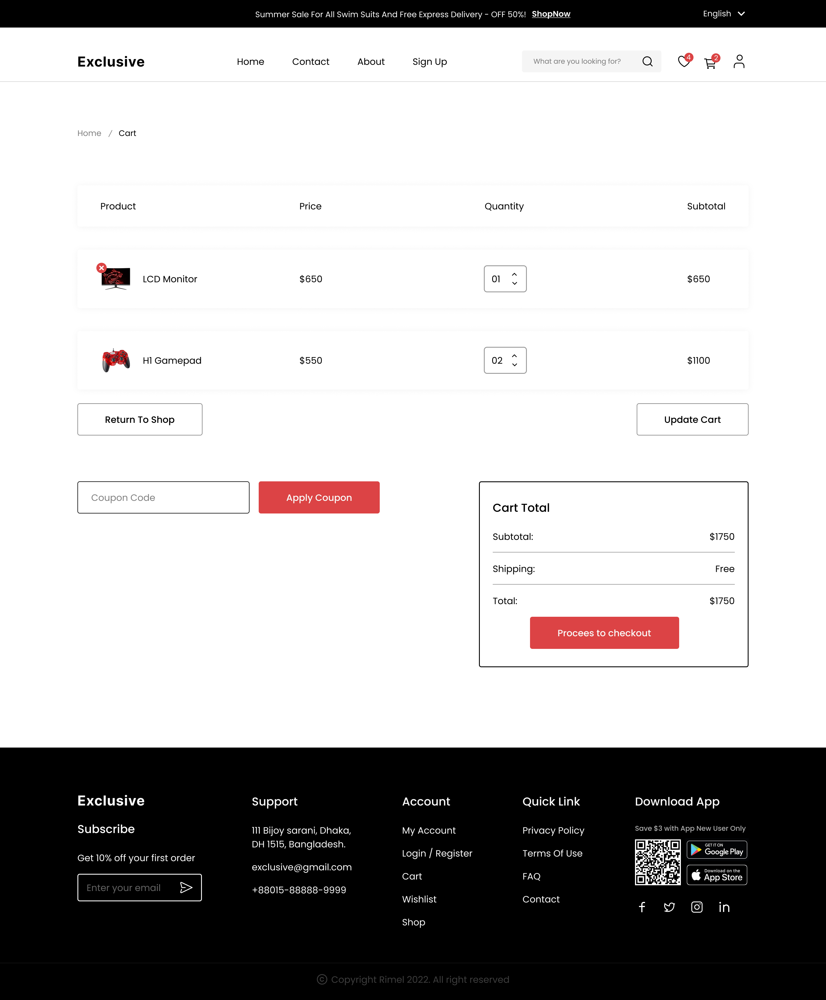
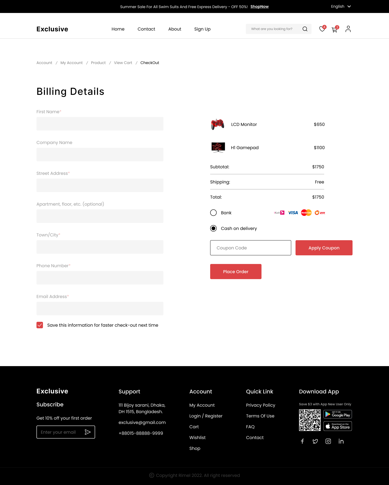
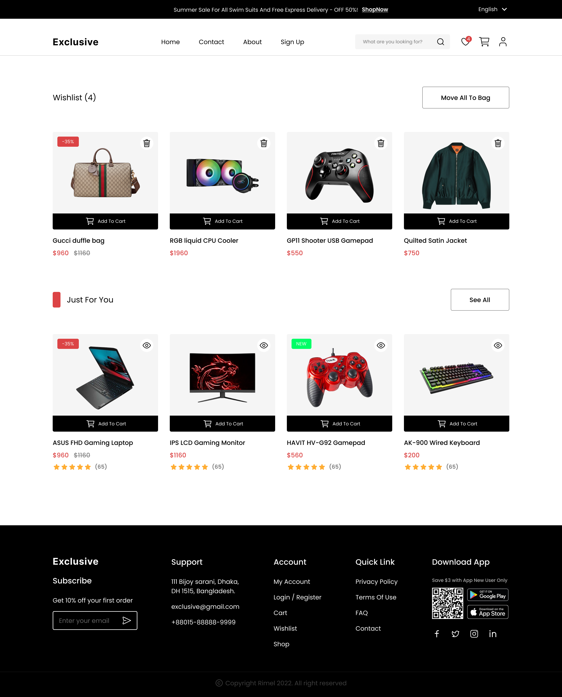
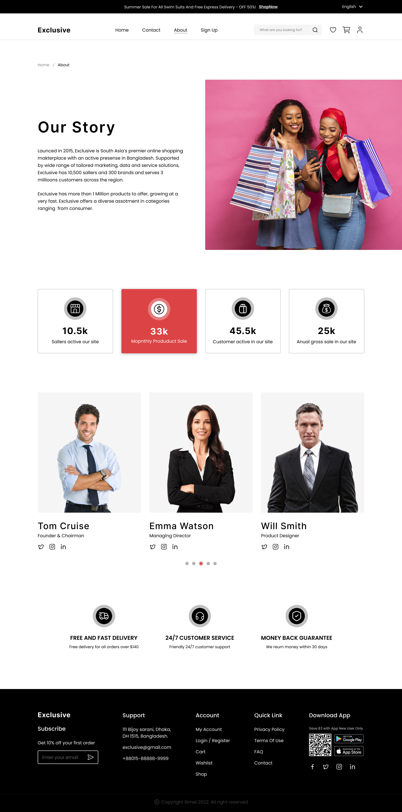

<div align="center">

# PrimeShop

### Full-Stack E-Commerce Web Application

[](https://reactjs.org/)
[](https://vitejs.dev/)
[](https://nodejs.org/)
[](https://www.mongodb.com/)
[](https://tailwindcss.com/)
[](https://www.docker.com/)

A modern, responsive e-commerce platform with an admin dashboard and AI-powered product chatbot.


</div>

---

## Features

### Customer-Facing
- **Product Browsing** — Browse products by category with filtering and search
- **Flash Sales** — Countdown-based flash sales with discounted pricing
- **Shopping Cart** — Add/remove items, manage quantities
- **Wishlist** — Save favorite products for later
- **Checkout** — Streamlined order placement flow
- **User Authentication** — Secure signup/login with JWT-based sessions
- **Product Ratings** — Like/dislike and comment system per product
- **AI Chatbot** — Floating chat widget powered by GPT-4o that answers product questions in real time

### Admin Dashboard
- **Product Management** — Full CRUD with Cloudinary image upload
- **Category Management** — Create, edit, and delete product categories
- **User Management** — Manage customer accounts and admin roles
- **Order Management** — Track and update order statuses (Pending, Processing, Shipped, Delivered, Cancelled)

---

## Screenshots

| Home | Product Details | Cart |
|:---:|:---:|:---:|
|  |  |  |

| Checkout | Wishlist | Login |
|:---:|:---:|:---:|
|  |  |  |

| Signup | About |
|:---:|:---:|
|  |  |

---

## Tech Stack

| Layer | Technology |
|---|---|
| **Frontend** | React 18, Vite 4, Tailwind CSS 3, Ant Design 5, Material UI 5 |
| **State Management** | Redux Toolkit, React-Redux |
| **Routing** | React Router DOM 6 |
| **HTTP Client** | Axios |
| **Backend** | Express.js 4, Node.js |
| **Database** | MongoDB with Mongoose 8 |
| **Authentication** | JWT (jsonwebtoken) + bcrypt |
| **Image Storage** | Cloudinary (via Multer) |
| **Email** | Nodemailer + Mailgun |
| **AI Integration** | OpenAI SDK (GPT-4o) |
| **Containerization** | Docker + Docker Compose |

---

## Project Structure

```
PrimeShop/
├── backend/                  # Express.js REST API
│   ├── index.js              # Entry point
│   ├── Controllers/          # Business logic (7 controllers)
│   ├── Routes/               # API routes (7 route files)
│   ├── Middlewares/          # Auth & upload middleware
│   ├── database/
│   │   ├── Connection.js     # MongoDB connection
│   │   └── Schemas/          # Mongoose models (7 schemas)
│   └── utils/                # bcrypt, jwt, cloudinary utilities
├── frontend/                 # React + Vite SPA
│   ├── src/
│   │   ├── pages/            # Page components (Home, Cart, Login, etc.)
│   │   ├── components/       # Reusable UI components
│   │   ├── features/         # Redux slices & API functions
│   │   ├── pannelAdmin/      # Admin dashboard
│   │   ├── assets/           # Images & icons
│   │   └── Layout/           # App layout wrapper
│   └── ...
├── design/                   # UI/UX design mockups
└── docker-compose.yml        # Docker orchestration
```

---

## Getting Started

### Prerequisites

- **Node.js** 18+
- **MongoDB** (Atlas cluster or local instance)
- **Cloudinary** account (for image uploads)
- **Mailgun** account (for email service)
- **OpenAI/GitHub API** token (for AI chatbot)

### Environment Variables

Create a `.env` file in the `backend/` directory:

```env
PORT=3320
DB_URL=mongodb+srv://<username>:<password>@cluster.mongodb.net/primeshop
JWT_TOKEN=your_jwt_secret

# Cloudinary
cloud_name=your_cloud_name
api_key=your_api_key
api_secret=your_api_secret

# Mailgun
DOMAIN=your_mailgun_domain
MAILGUN_KEY=your_mailgun_api_key

# OpenAI / GitHub GPT
GITHUB_GPT=your_api_token
```

Create a `.env` file in the `frontend/` directory:

```env
VITE_API_BASE_URL=http://localhost:3320/api
VITE_APP_DESC=development
```

### Installation

```bash
# Clone the repository
git clone https://github.com/your-username/PrimeShop.git
cd PrimeShop

# Install root dependencies
npm install

# Install backend dependencies
cd backend
npm install

# Install frontend dependencies
cd ../frontend
npm install
```

### Running the App

```bash
# Start backend (with nodemon)
cd backend
npm start
# => http://localhost:3320

# Start frontend dev server
cd frontend
npm run dev -- --host
# => http://localhost:5173
```

### Docker Deployment

```bash
docker-compose up --build
```

| Service | Container | Port |
|---|---|---|
| Backend | `backendcontainer` | 3324 → 3320 |
| Frontend | `frontcontainer` | 3325 → 5173 |

---

## API Endpoints

| Method | Endpoint | Description |
|---|---|---|
| POST | `/api/users/signup` | Register a new user |
| POST | `/api/users/login` | User login |
| GET | `/api/products` | Get all products |
| GET | `/api/products/:id` | Get product by ID |
| POST | `/api/products` | Create product (admin) |
| PUT | `/api/products/:id` | Update product (admin) |
| DELETE | `/api/products/:id` | Delete product (admin) |
| GET | `/api/categories` | Get all categories |
| POST | `/api/categories` | Create category (admin) |
| GET | `/api/card` | Get user cart |
| POST | `/api/card` | Add item to cart |
| GET | `/api/orders` | Get user orders |
| POST | `/api/orders` | Place an order |
| GET | `/api/ratings/:productId` | Get product ratings |
| POST | `/api/ratings` | Submit a rating |
| POST | `/api/gpt` | AI chatbot query |

---

## Data Models

| Model | Fields |
|---|---|
| **User** | firstname, lastname, email, phone, password, role (client/admin) |
| **Product** | name, description, price, category, image, quantity, promo, ratings |
| **Category** | name, icon (SVG) |
| **Cart** | user, product, quantity |
| **Order** | user, date, status, product, quantity, finalPrice |
| **Rating** | user, product, liked, comment, date |
| **Address** | address, city, country, postalCode, user |

---

## Design

The UI/UX design originates from a Figma community template. The `design/` folder contains 15 mockup screenshots covering all major pages and responsive views.

---

## License

This project is for educational purposes.

---

<div align="center">

**Built with React, Express, MongoDB & Tailwind CSS**

Made by **Rachid Mouhcine** & **Ismail Sayen**

</div>
